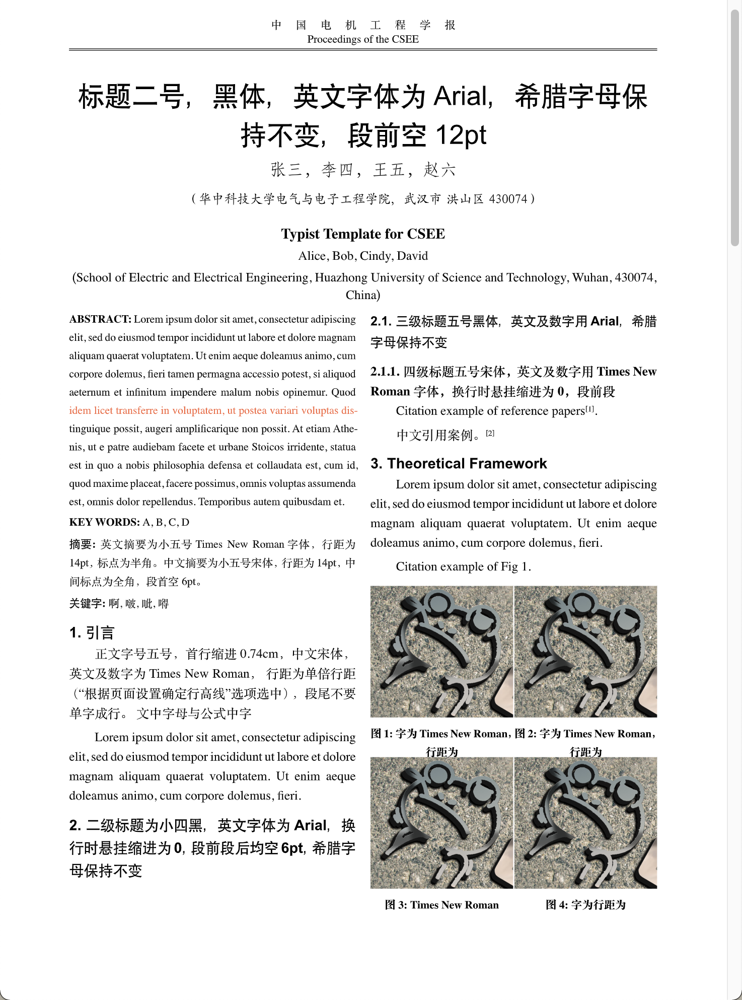
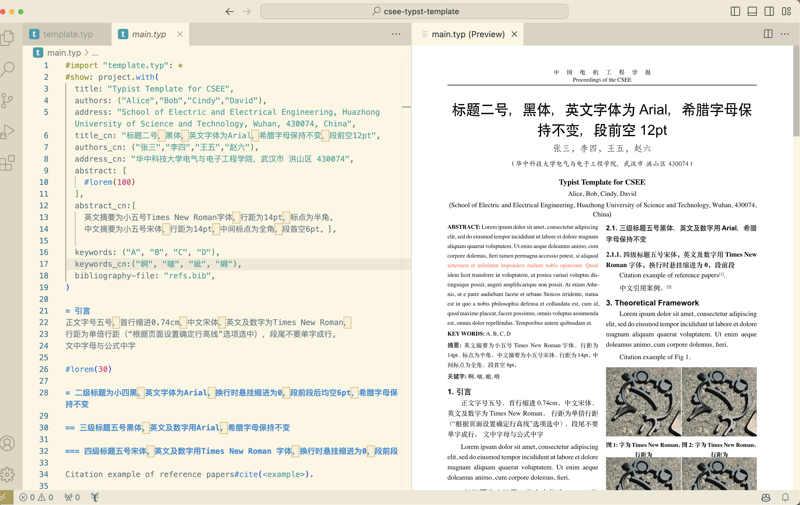

# CSEE [Typst](https://typst.app) Template
- [English](#what-is-mcmicm)
- [中文](#what-is-mcmicm)

Typst template for [CSEE (Chinese Society for Electrical Engineering)](https://www.csee.org.cn/).

## What is CSEE
> The Chinese Society for Electrical Engineering (CSEE) is a prominent academic organization in China that focuses on advancing electrical engineering. It has a large membership base and aims to promote scientific research, academic exchanges, and the application of electrical engineering knowledge. CSEE organizes conferences, seminars, and exhibitions, publishes high-quality journals, and maintains technical committees covering various areas of electrical engineering. The society actively engages in international collaborations to foster global advancements in the field.
>
> generated by chatgpt

CSEE only privides [word template](CSEE_Template.doc) for users.
Based on the official template and guidelines, I diy the Typst version.

## What is Typst
Typst is a new markup-based typesetting system that is designed to be as powerful as LaTeX while being much easier to learn and use.

- [Typst Github](https://github.com/typst/typst)
- [Typst Homepage](https://typst.app)

## Preview
See the [main.pdf](main.pdf).

## Preview
- ./img/  # default image folder
- ./appendices.typ # appendices of the thesis
- ./main.typ  # main body of the thesis
- ./template.typ  # template file
- ./[main.pdf](main.pdf) # default output pdf
- ./refs.bib # bibliography file

## Usage:
Run `typst compile main.typ` to obtain main.pdf

You can try it online ([Click Me](https://typst.app/project/pxdKIC-xO_H20K5NAg_9sm)) or run locally.
I strongly recommand writing with VSCode. 

## Version
Typst>=0.9.0 is recommanded.

## TODO
- Table and figure captions of both Chinese and English.

## Contribute
Welcome to PRs.
